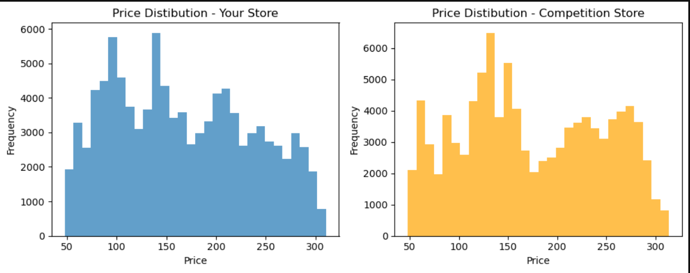

# Store Price Optimization

Price optimization is a strategic method that leverages data analysis and modeling to identify the most effective pricing for products or services. It takes into account key factors such as market demand, competition, costs, and customer behavior to set prices that enhance both profitability and market share.

## Table of Contents

- [About the Project](#about-the-project)
- [Dataset](#dataset)
- [Technologies Used](#technologies-used)
- [Analysis](#analysis)
- [Results](#results)
- [Future Work](#future-work)
- [Acknowledgements](#acknowledgements)

---

## About the Project

Price optimization is a strategic process that involves gathering data on sales, costs, competitors, and market trends to forecast demand fluctuations and assess price elasticity. This approach allows businesses to set optimal prices by incorporating competitive analysis to track market positioning, customer segmentation to understand different levels of willingness to pay, and mathematical optimization algorithms to identify the most effective pricing strategies.

## Dataset

To get started with the task of Price Optimization, we need a dataset based on sales, costs, competition, and market trends. I found an ideal dataset for this task which contains features like:
| Variable | Description |
|----------|-------------|
| Fiscal_Week_Id | The fiscal week identifier |
| Store_Id | The store identifier |
| Item_Id | The item identifier |
| Price | Price of the item at our store |
| Item_Quatity | Quantity of the item sold |
| Sales_Amount_No_Discount | Sales without discount |
| Sales_Amount | Sales with discount |
| Competition_Price | The price of the item at a competion store |

## Technologies Used

- Python
- Pandas
- Matplotlib
- Jupyter Notebook

## Analysis
- Comparing price distribution with competition

- Relationship between price and sales amount
  
.png)

## Results

### Evaluation Metrics

| Metric | Value % |
|--------|-------|
| Validation Loss | 74.35 |
| Validation Accuracy | 72.83 |
| Model Loss | 69.81 |
| Model Accuracy | 73.11 |

### Output

This is how the output will be shown after running main.py file

## Future Work

- Use transfer learning with pretrained models (e.g., VGG16, ResNet50)
- Deploy as a web application
- Optimize model for mobile devices

## Acknowledgements

- TensorFlow Tutorials
- [Public Flower Dataset](https://www.kaggle.com/datasets/imsparsh/flowers-dataset)
- Kaggle Community
- ChatGPT
- Anaconda Distribution

NOTE:- THIS PROJECT WAS CREATED FOR ONLY PRACTICE AND A LOT OF TECHNIQUES AND ALGORITHMS ARE NOT YET USED. THANK YOU! :)
