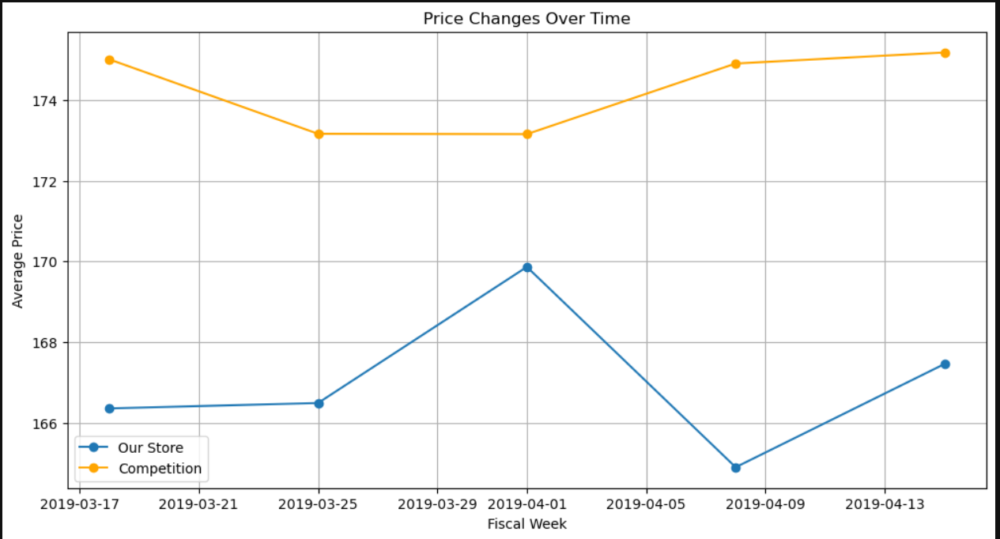

# Store Price Optimization

Price optimization is a strategic method that leverages data analysis and modeling to identify the most effective pricing for products or services. It takes into account key factors such as market demand, competition, costs, and customer behavior to set prices that enhance both profitability and market share.

## Table of Contents

- [About the Project](#about-the-project)
- [Dataset](#dataset)
- [Technologies Used](#technologies-used)
- [Analysis](#analysis)
- [Results](#results)
- [Acknowledgements](#acknowledgements)

---

## About the Project

Price optimization is a strategic process that involves gathering data on sales, costs, competitors, and market trends to forecast demand fluctuations and assess price elasticity. This approach allows businesses to set optimal prices by incorporating competitive analysis to track market positioning, customer segmentation to understand different levels of willingness to pay, and mathematical optimization algorithms to identify the most effective pricing strategies.

## Dataset

To get started with the task of Price Optimization, we need a dataset based on sales, costs, competition, and market trends. I found an ideal dataset for this task which contains features like:
| Variable | Description |
|----------|-------------|
| Fiscal_Week_Id | The fiscal week identifier |
| Store_Id | The store identifier |
| Item_Id | The item identifier |
| Price | Price of the item at our store |
| Item_Quatity | Quantity of the item sold |
| Sales_Amount_No_Discount | Sales without discount |
| Sales_Amount | Sales with discount |
| Competition_Price | The price of the item at a competion store |

## Technologies Used

- Python
- Pandas
- Matplotlib
- Jupyter Notebook

## Analysis

### Comparing Price Distribution with Competition.

It indicates that competitors generally have higher prices, with significant peaks in the 100–150 and 200–250 ranges, suggesting a concentration of higher-priced products. In comparison, our store's prices are more evenly spread across the 50–300 range, with prominent peaks around the 100–150 mark.

### Relationship between Price and Sales Amount in Our and the Competitor's Store.
  
.png)

The scatter plots illustrate the relationship between price and sales amount for our store (left) and the competition (right). In our store’s plot, sales amounts are widely scattered across different price points, reflecting inconsistent performance and a lack of a clear trend. On the other hand, the competition’s plot reveals a dense concentration of higher sales amounts, with prices distributed across a similar range but showing more consistent sales outcomes. This suggests that the competition may be employing a more effective pricing strategy that sustains stronger sales levels across various price points.

### Comparing the Price Changes Over Time.

The competition consistently maintains higher average prices above 170, showing a slight upward trend over the observed weeks. In comparison, our store’s prices begin around 166, rise modestly, then decline before increasing again. This suggests that the competition employs a more stable pricing strategy, whereas our store’s pricing fluctuates more noticeably. The competition’s pricing stability may be a key factor contributing to their stronger and more consistent sales performance.

### Price Elasticity of Demand Over Time.

Now, let’s analyze how changes in prices affect the change in quantity sold. For this, we need to calculate price elasticity. Here’s the formula used to calculate price elasticity:
___Ed = % change in quantity / % change in price___

The graph illustrates how price elasticity of demand varies over time, revealing significant fluctuations from strongly negative to strongly positive values across different weeks. This indicates that the responsiveness of demand to price changes is highly inconsistent. In weeks with high positive elasticity, demand rose notably alongside price increases, whereas in weeks with high negative elasticity, demand dropped sharply as prices went up. The wide range of elasticity values suggests that demand is not solely driven by price changes, and other factors—such as promotions, seasonal trends, or market dynamics—may be playing a substantial role in influencing consumer behavior.

### Comparing the Total Sales Amounts for Our Store and the Competition's

| Metric | Your Store | Competition |
|--------|------------|-------------|
| Total Sales Amount | 1.141005e+08 | 6.962097e+08 |
| Total Quantity Sold | 3.98477e+06 | 3.98477e+06 |

Our store's total sales amount is 114,100,500, while the competition's total sales amount is 696,209,700 (assuming equal quantities sold). The competition's sales are considerably higher, suggesting that their pricing strategy is more effective in driving revenue.

## Price Optimization with Dynamic Pricing

_Dynamic pricing is a pricing strategy in which the price of a product or service is adjusted in real time or at regular intervals based on various factors such as demand, supply, customer behavior, market conditions, and competitor pricing. The goal of dynamic pricing is to maximize revenue, profit, or market share by setting prices that reflect current market dynamics. This strategy is commonly used in industries like e-commerce, airlines, hospitality, and ride-sharing, where demand can fluctuate rapidly._

Outlining and simulating a dynamic pricing model. The process will involve the following steps:

- First, we'll enrich our dataset by incorporating customer segments and calculating price elasticity for each one.  
- These segments will be defined based on purchasing behavior, allowing us to assess elasticity at a more granular level.  
- Next, we’ll establish dynamic pricing rules that take into account competitor pricing, demand trends, and segment-specific elasticity.  
- Finally, we’ll simulate the performance of the dynamic pricing model and compare it against the current pricing strategy.  

Price elasticity for each segment:
| Segment | Average Elasticity |
|---------|--------------------|
| Medium | 0.071118 |
| High | 0.143993 |

The “High” segment has an average elasticity of 0.143993, indicating that these customers are more sensitive to price changes. In contrast, the “Medium” segment has a lower average elasticity of 0.071118, suggesting they are less responsive to price variations.

## Results

Based on the elasticity analysis, we can establish the following dynamic pricing rules:

- _Medium Segment (Inelastic Demand):_ Since demand in this segment is relatively insensitive to price changes, we can implement modest price increases to boost revenue with minimal impact on sales volume.  
- _High Segment (Elastic Demand):_ With demand being highly sensitive to price fluctuations, pricing should be carefully optimized to strike a balance that maximizes revenue without significantly reducing sales volume.

Implemented the dynamic pricing model (Our Store):

| Metric | Existing Pricing | Dynamic Pricing |
|--------|------------------|-----------------|
| Total Sales Amount | 1.141005e+08 | 6.962097e+08 |
| Total Quantity Sold | 3.98477e+06 | 3.98477e+06 |

Equivalent to that of competition's

__How it's done:__
We began by duplicating the dataset for simulation purposes. Dynamic pricing rules were then applied—prices were increased by 5% for the Medium segment and decreased by 10% for the High segment. Using these adjusted prices, we recalculated the sales amounts. Finally, we compared the total sales amount and total quantity sold between the current pricing strategy and the dynamic pricing model.

## Acknowledgements

- [thecleverprogrammer](https://thecleverprogrammer.com/2024/07/22/price-optimization-using-python/)
- [Dataset](https://statso.io/price-optimization-case-study/)

NOTE:- THIS IS A BASIC PROJECT BUILT FOR PRACTICE PURPOSE ONLY. THANK YOU! :)
